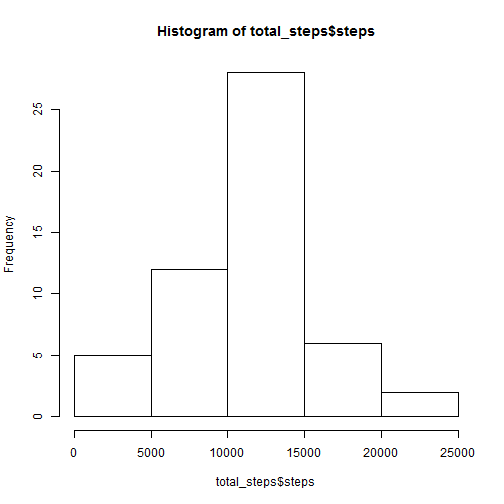
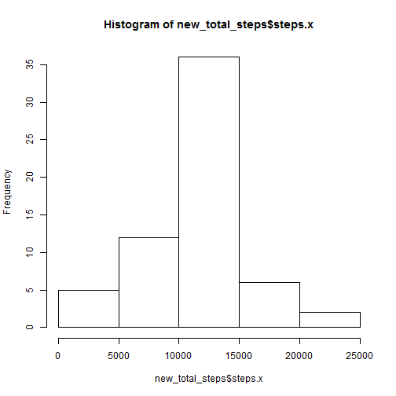
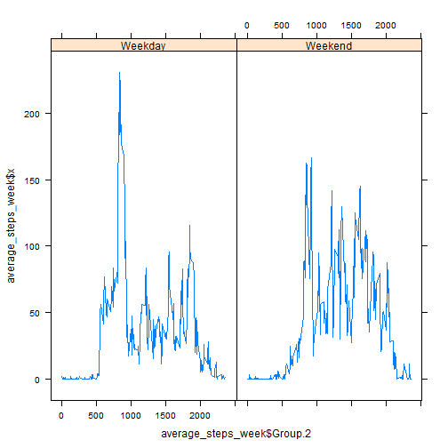

We begin by reading the file into R.


```r
data <- read.csv("./repdata_data_activity/activity.csv")
```

**What is mean total number of steps taken per day?**  
Here, we sum the total number of steps taken each day using the aggregate function.
Then a histogram is plotted, with the mean and median displayed after it.

```r
total_steps <- aggregate(steps ~ date, data=data, sum)
hist(total_steps$steps)
```

 

```r
mean(total_steps$steps)
```

```
## [1] 10766
```

```r
median(total_steps$steps)
```

```
## [1] 10765
```

**What is the average daily activity pattern?**  
By using the aggregate funtion, we can group the data according to the interval, and for this question, we are interested in the mean.

```r
average_steps_interval <- aggregate(steps ~ interval, data=data, mean)
plot(average_steps_interval, type="l")
```

 

To find the 5-minute interval with the maximum number of steps, we can use the which.max function.

```r
max_step <- average_steps_interval$interval[which.max(average_steps_interval$steps)]
```
So the 5-minute interval with the maximum number of steps is at 835.

**Imputing missing values**

To find the toal number of NA values in the dataset, we combine the sum and is.na functions.

```r
missing <- sum(is.na(data$steps))
```
The total number of missing values in the dataset is 2304.

To fill in the missing values, we will use the mean for that particluar 5-minute interval.

```r
#Merge the data with the mean 5-minute interval
new_impute_data <- merge(data, average_steps_interval, by="interval" )
#Identify the rows with the NA values
na <- is.na(new_impute_data$steps.x)
#For the row which has NA, make it equal to the mean 5-minute interval
new_impute_data$steps.x[na] <- new_impute_data$steps.y[na]
```
Once we have the new dataset, we can plot a new histogram and obtain the new mean and median for the data.

```r
new_total_steps <- aggregate(steps.x ~ date, data=new_impute_data, sum)
hist(new_total_steps$steps.x)
```

 

```r
mean(new_total_steps$steps.x)
```

```
## [1] 10766
```

```r
median(new_total_steps$steps.x)
```

```
## [1] 10766
```
The histogram is similar to the one earlier. This is because we have imputed the NA values with the corresponding 5-minute interval. As a result, we do not expect to see a difference in the histogram as we are simply re-using the same values again. The same applies to the mean and median values, because we are using the mean value, it will have no impact on the median and mean values.

**Are there differences in activity patterns between weekdays and weekends?**

We need to create a factor variable depending on the dates.

```r
new_impute_data$day <- weekdays(as.Date(new_impute_data$date))
new_impute_data$week <- as.factor(ifelse(new_impute_data$day %in% c("Saturday","Sunday"), "Weekend", "Weekday"))
```
Then we can aggregate the data according to the factor variable, week, and the interval, to find the mean steps taken over that particular interval.

```r
average_steps_week <- aggregate(new_impute_data$steps.x, by=list(new_impute_data$week, new_impute_data$interval), FUN=mean)
```
Finally, we can plot the data to see the difference in steps taken between weekday and weekend.

```r
library(lattice)
xyplot(average_steps_week$x ~ average_steps_week$Group.2 | average_steps_week$Group.1, layout = c(2, 1), type="l")
```

 

From the 2 plots, it seems there are more steps taken during the early hours (800 - 1000) on a weekday. On the other hand, there are more steps taken during the midday (1200 - 1500) on a weekend.
